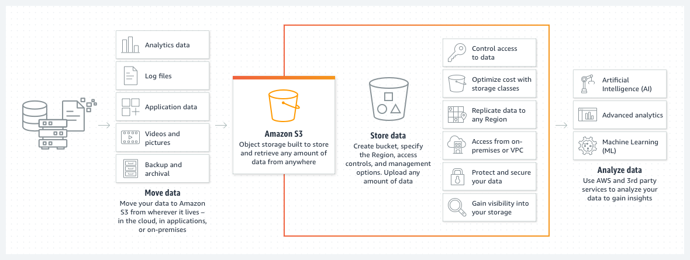
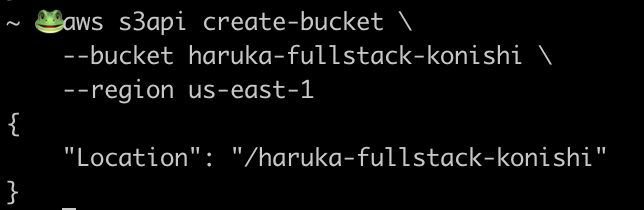
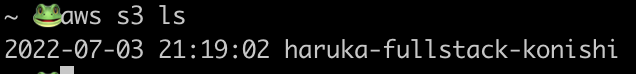

# Lecture - Creating a Static Website Using S3



# Creating a Static Website - Lab

This repository contains instructions for the Lab Lecture - Creating a Static Website

## Static Website Creation using AWS CLI

AWS Services Used:

- S3
    - Create a static website hosted in an S3 bucket
- IAM
    - Configure AWS CLI with an IAM user with S3 permissions:
        - CreateBucket
        - ListBucket
        - PutObject

---

## Project Structure

The infrastructure for projecti s defined below:

```bash
├── README.md <------------- This guide to the project.
├── index.html <------------ website landing page
├── error.html <------------ error redirect page
├── policy.json <----------- bucket policy
└── animal.jpeg <---- ------ website image
```

---

### Prequisites:

- AWS CLI Installed and Configured
    - Documentation: [https://docs.aws.amazon.com/cli/latest/userguide/getting-started-install.html](https://docs.aws.amazon.com/cli/latest/userguide/getting-started-install.html)

    ```bash
    # check if AWS configured your user correctly
    aws sts get-caller-identity
    ```

- AWS IAM User Configured with S3 Permissions
- An image of your favorite animal **[🐸](https://emojipedia.org/emoji/%F0%9F%90%B8/#:~:text=Unicode%20details%20for%20Frog%20Face%20(%F0%9F%90%B8)%20emoji.)**
- This github repository in your local environment

---

## AWS CLI: Create Bucket

- Open terminal
- Create a bucket using the following command with the following changes:
    - Change $YOUR_FIRST_NAME to your first name
    - Change $YOUR_LAST_NAME to yout last name

```bash
#AWS Command:
aws s3api create-bucket \
    --bucket $YOUR_FIRST_NAME-fullstack-$YOUR_LAST_NAME \
    --region us-east-1 \
		--acl public-read

#Sample AWS Command:
aws s3api create-bucket \
    --bucket haruka-fullstack-konishi \
    --region us-east-1 \
    --acl public-read
```

- If your bucket is successfully created, you should see the following message:

    


---

## AWS CLI: Check Bucket

- Open terminal
- Check if the bucket was created by using the list-bucket command:

```bash
#AWS Command:
aws s3 ls
```

- The following command should return back the name of your bucket:



---

## Get and Edit Website Animal

- Go on google and find an image of your favorite animal
- Download the image in the imgs folder in the repository with the name animal
    - Overwrite the current image if possible
    - If the downloaded image is a different file type, change it to the new file type in code on line 8 in the index.html code.
        - For example: .jpeg → .png

---

## AWS CLI: Upload Bucket Objects

- Open terminal
- Change directory into the github repository
- Run the following commands to add the following objects to the newly created s3 bucket:

```bash
#Add index.html 
aws s3api put-object --bucket $BUCKET_NAME --key index.html --body index.html
aws s3api put-object --bucket $BUCKET_NAME --key error.html --body error.html
aws s3api put-object --bucket $BUCKET_NAME --key animal.jpeg --body animal.jpeg

#Example Commands:
aws s3api put-object --bucket haruka-fullstack-konishi --key index.html --body index.html
aws s3api put-object --bucket haruka-fullstack-konishi --key error.html --body error.html
aws s3api put-object --bucket haruka-fullstack-konishi --key animal.jpeg --body animal.jpeg
```

Note: If the image file was named differently (animal.jpeg) make sure to change it in the command as well. 

---

## Set bucket policy (will go over next lecture)

- Open terminal
- Change directory into the github repository
- Run the following command to update the bucket policy:

```bash
#Update bucket policy
aws s3api put-bucket-policy --bucket $BUCKET_NAME --policy file://policy.json

#Example Command
aws s3api put-bucket-policy --bucket haruka-fullstack-konishi --policy file://policy.json
```

---

## AWS CLI: Set for Website Access

- Open the terminal
- Run the following command for setting up a static website:

```bash
aws s3 website s3://$BUCKET_NAME/ --index-document index.html --error-document error.html

aws s3 website s3://haruka-fullstack-konishi/ --index-document index.html --error-document error.html
```

---

## AWS CLI: Set Bucket to host static website

- Open the browser of your choice
- Open the URL:
    - http://$BUCKET_NAME.s3-website.us-east-1.amazonaws.com/
    - Example:
        - [http://haruka-fullstack-konishi.s3-website.us-east-1.amazonaws.com/](http://haruka-fullstack-konishi.s3-website.us-east-1.amazonaws.com/)

---

# Last Step: Profit!